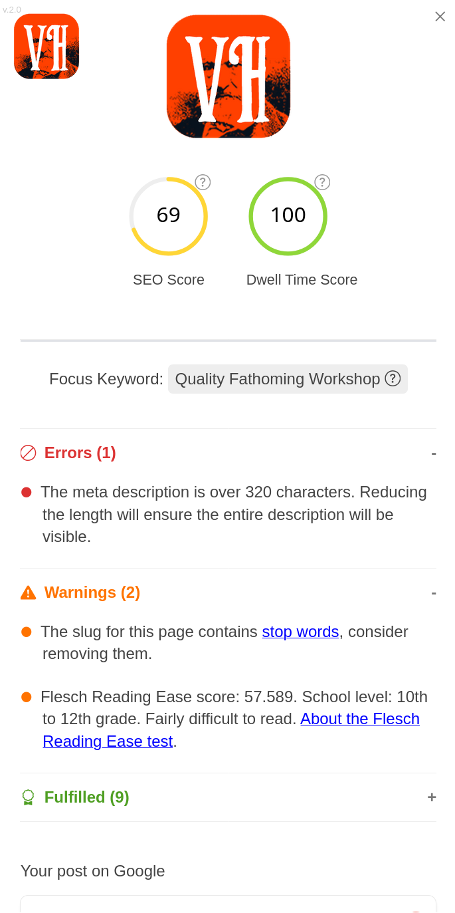

# Victor Hugo 2.0


The local search engine optimization plug-in for the [Hugo](https://gohugo.io/) static site generator framework. Victor Hugo helps you write good SEO content, the easy way.

[Report bug](https://github.com/aharchitect/victorhugo/issues) | [SEO Snippets](misc/hugo-seo-snippets.md) | [Say Thanks](#say-thanks)

## Overview

**Victor Hugo** is a SEO plugin for [Hugo](https://gohugo.io/), the world's fastest framework for building websites. It audits your content as you write it and gives you an estimate based on best SEO practices, so you can improve your SERP (Search Engine Results Pages).

**Victor Hugo uses no browser extensions, no external services, no installs. It lives in a simple partial. One line of code and you are ready to write SEO-friendly content.**



When writing a blog post, Victor Hugo will:
* Check for stop words in your page slug.
* Check for passive voice in your copy.
* Make sure you optimize your content for google and other search engines by using a keyword/keyphrase of your choosing.
* Help you write SEO friendly meta descriptions
* Run your copy through an included version of the [Flesch Reading Ease Test](https://en.wikipedia.org/wiki/Flesch%E2%80%93Kincaid_readability_tests), and give you an easy-to-read score.

...and more, much more, right in your browser, without having to subscribe to any extra tool. 

With Victor Hugo, you will write optimized SEO content from the get-go, so you don't have to do it later when your blog post is already online.


## Install

Victor Hugo is a [Hugo](https://gohugo.io/) theme component that can be added alongside your existing theme. Besides jQuery, Victor Hugo has no other dependencies; it makes no server-side calls, it does not run anything on the backend, and it does not need a database.

Add Victor Hugo as a theme or submodule and include it before your main theme:

```toml
theme = ["victorhugo", "your-theme"]
```

### Dependencies

Victor Hugo needs jQuery installed, but don't despair: if you don't have a jQuery version installed in your Theme Victor Hugo makes a call to the latest version from the official jQuery CDN and uses that one to work its magic. That means that, **if your Theme doesn't use jQuery, then you don't have to install it just to use Victor Hugo**.

On the other hand, if you use jQuery and don't want Victor Hugo using the official CDN, you can easily configure it not to do so.

### Safety First Approach

Thanks to the **.IsServer** directive of Hugo, Victor Hugo will **never, ever get built into the public directory of your project**. The '.IsServer' directive makes sure Victor Hugo gets executed only when you are in Hugo's local built-in server.

You will never see a trace of Victor Hugo in your public folder and, since it is a standard Hugo partial template like any other, you can remove it anytime you want from your project by deleting it. 

## Getting Started

To use Victor Hugo, all you have to do is:
1. Add this repository under your [Hugo](https://gohugo.io/) site's `themes/victorhugo` directory.
2. Add `victorhugo` to your `theme` list before your main theme.
3. Call it with `{{ partial "victorhugo" . }}` in your base template.

Victor Hugo only renders while `hugo server` is running.

### Configure Victor Hugo

Victor Hugo is enabled by default when the partial is included in your local Hugo server. Add a focus keyword in the _front matter_ of any post you want Victor Hugo to run SEO checks for.

```
focus_keyword: ""
```

**focus_keyword:** the word or phrase Victor Hugo will use to run a check on your copy—including the SEO title, H1 tag, body copy, and images. This is the keyword or phrase that you want your post to be found for in search engines. Victor Hugo will let you know how well you have optimized your copy for this keyword or phrase.

**victor_hugo_disabled:** accepts true or false. Set it to true in a page's front matter to disable Victor Hugo for that page.

**victor_hugo_readability_threshold:** accepts a number and can be set globally in your site params or per page. It defines the minimum Flesch Reading Ease score that should count as fulfilled. The default is `60`; for expert or college-level content, `40` can be a better fit.

**Victor_Hugo_Clean:** accepts true or false. If true, it will not import jQuery. If it is set to false, it will import jQuery. Note that the jQuery Library won't be added to your project, it will only be used through jQuery's official CDN and it is necessary for Victor Hugo to run.

### Examples

```
focus_keyword: "Yoast Plugin for WordPress"
```
Another example:
```
focus_keyword: "Free Bundle Magazine"
```
One more:
```
focus_keyword: "Writing Github Documentation"
```
Last one, proimise:
```
focus_keyword: "Gladiator"
```

Victor Hugo will help you write content that ranks with your Focus Keyword or Focus Keyphrase in mind.

That's it, you can now start using Victor Hugo and ranking like a champ!

## Say thanks

This version of Victor Hugo is a fork of [Javier Cabrera's original plugin](https://github.com/doncabreraphone/victorhugo). Javier created a charming and useful idea: a local SEO assistant that lives inside a Hugo site and helps authors while they write. Thank you, Javier, for putting the first version into the world.

I liked the project and its results, so I adapted it to my own workflow, fixed some calculations, and improved the usability for theme-based Hugo integration.

Feel free to use this fork. If it helps you, a short "Thanks" is always welcome on [LinkedIn](https://www.linkedin.com/in/andreas-hinkelmann-aha/), [GitHub](https://github.com/aharchitect), or the [Fediverse](https://mastodon.social/@aharchitect).

## License

Code and documentation under GNU GENERAL PUBLIC LICENSE Version 3. Read the [LICENSE](LICENSE) file included in this repository for the complete version.
